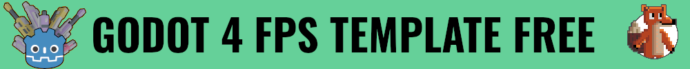
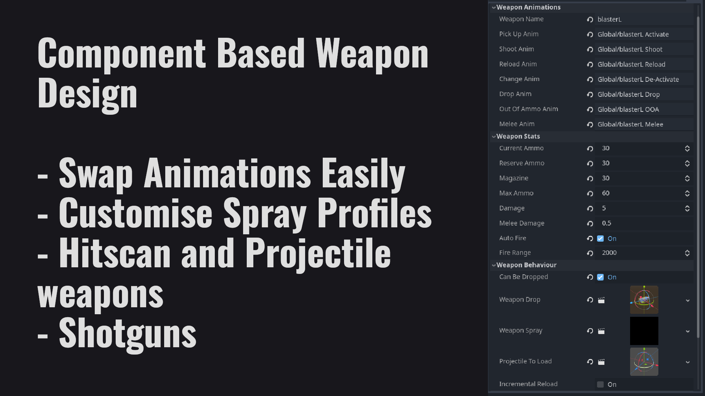

# 🧟 Revenge of the Dead - Üs Savunma Oyunu

**Revenge of the Dead**, Godot 4 ile geliştirilmiş birinci şahıs bakış açısı üs savunma oyunudur. Oyuncular, dalgalar halinde gelen zombi saldırılarına karşı üslerini savunmaya çalışır.

## 🎮 Oyun Hakkında

**Revenge of the Dead**, klasik tower defense ve FPS türlerini birleştiren heyecan verici bir hayatta kalma oyunudur. Oyuncular stratejik pozisyonlarda savunma yaparak, çeşitli silahlarla donanmış şekilde zombi ordularına karşı mücadele eder.

### 🎯 Ana Özellikler

- **🏰 Üs Savunması**: Stratejik pozisyonlarda üsünüzü zombilere karşı koruyun
- **🌊 Dalga Sistemi**: Her dalga ile artan zorlukta düşman saldırıları
- **🔫 Gelişmiş Silah Sistemi**: Çeşitli silah türleri ve modüler yapı
- **🤖 Akıllı Düşman AI**: Farklı davranış kalıplarına sahip zombi türleri
- **🎮 Tek Oyuncu**: Şu anda tek oyuncu modunda (gelecekte çok oyunculu planlanıyor)

### 🧟 Düşman Türleri

- **⚔️ Yakın Dövüş Canavarı**: Yüksek can, yakın mesafe saldırıları
- **🔫 Pompalı Tüfek Saldırganı**: Hızlı ve agresif yakın mesafe savaşçısı
- **🎯 Tüfekli Asker**: Orta mesafe hassas atışları

### 🔧 Teknik Özellikler

#### Silah Sistemi
- **Kaynak Tabanlı**: Tüm silahlar `WeaponResource` dosyaları ile yapılandırılır
- **Modüler Tasarım**: Mermi türleri, yayılma kalıpları ve davranışlar değiştirilebilir
- **Durum Makinesi**: Silah değiştirme, atış ve şarjör değiştirme yönetimi
- **Animasyon Entegrasyonu**: Sorunsuz animasyon sistemi desteği

#### Oyuncu Kontrolü
- **Hareket**: WASD ile fizik tabanlı hareket
- **Kamera**: Fare ile bakış kontrolü
- **Çömelme**: C tuşu ile çömelme/kalkma
- **Eğilme**: Q/E tuşları ile sola/sağa eğilme
- **Koşma**: Shift ile stamina tabanlı koşma

#### AI Sistemi
- **Performans Odaklı**: Optimize edilmiş düşman davranışları
- **Nesne Havuzu**: Düşman ve mermi yeniden kullanımı
- **Mesafe Tabanlı LOD**: Uzak düşmanlar için düşük güncelleme sıklığı
- **Dalga Yöneticisi**: Konfigüre edilebilir dalga ilerlemesi

## 🚀 Kurulum

1. **Godot 4.5+** sürümünü indirin
2. Projeyi klonlayın: `git clone https://github.com/jumpthe11/revenge-of-the-dead.git`
3. Godot'ta `project.godot` dosyasını açın
4. Oyunu çalıştırmak için **F5** tuşuna basın

## 🎮 Kontroller

### Hareket
| Eylem | Tuş | Açıklama |
|-------|-----|----------|
| Hareket | WASD | Karakter hareketi |
| Bakış | Fare | Kamera kontrolü |
| Zıplama | Space | Zıplama |
| Koşma | Shift | Hızlı koşma |
| Çömelme | C | Çömelme/kalkma |
| Eğilme | Q/E | Sola/sağa eğilme |

### Savaş
| Eylem | Tuş | Açıklama |
|-------|-----|----------|
| Ateş | Sol Fare | Birincil ateş |
| İkincil Ateş | Sağ Fare | Alternatif ateş modu |
| Şarjör | R | Şarjör değiştirme |
| Yakın Dövüş | F | Yakın dövüş saldırısı |
| Silah Bırak | G | Mevcut silahı bırak |

## 🛠️ Geliştirme

### Yeni Silah Ekleme
1. `Player_Controller/scripts/Weapon_State_Machine/Weapon_Resources/` dizininde yeni `WeaponResource` oluşturun
2. Silah sahnesini `Player_Controller/Spawnable_Objects/Weapons/` dizininde oluşturun
3. Animasyonları ve istatistikleri kaynak dosyasında yapılandırın

### Yeni AI Düşmanı Ekleme
1. `AIEnemyBase` sınıfından yeni bir sınıf türetin
2. `AI_System/scripts/` dizininde davranış scriptini oluşturun
3. `AI_System/scenes/` dizininde düşman sahnesini oluşturun

## 🔮 Gelecek Planları

- **🌐 Çok Oyunculu Mod**: Arkadaşlarınızla birlikte üs savunması
- **🏗️ Üs İnşa Sistemi**: Savunma yapıları ve tuzaklar
- **📈 İlerleme Sistemi**: Karakter ve silah geliştirme
- **🌍 Yeni Haritalar**: Farklı ortamlar ve zorluklar
- **👥 Takım Modu**: Koordineli takım oyunu

## 📄 Lisans

- **Kod**: MIT Lisansı
- **Varlıklar**: Creative Commons (Kenny's Blaster Kit)

## 🤝 Katkı

Projeye katkıda bulunmak için:
1. Repository'yi fork edin
2. Yeni bir branch oluşturun (`git checkout -b ozellik/yeni-ozellik`)
3. Değişikliklerinizi commit edin (`git commit -m 'Yeni özellik eklendi'`)
4. Branch'inizi push edin (`git push origin ozellik/yeni-ozellik`)
5. Pull Request oluşturun

## 📞 İletişim

- **Geliştirici**: jumpthe11
- **GitHub**: [https://github.com/jumpthe11/revenge-of-the-dead](https://github.com/jumpthe11/revenge-of-the-dead)

---

*Bu proje, Godot 4 FPS Template temel alınarak geliştirilmiştir. Orijinal template için [Chaff Games](https://chaffgames.com) ekibine teşekkürler.*
